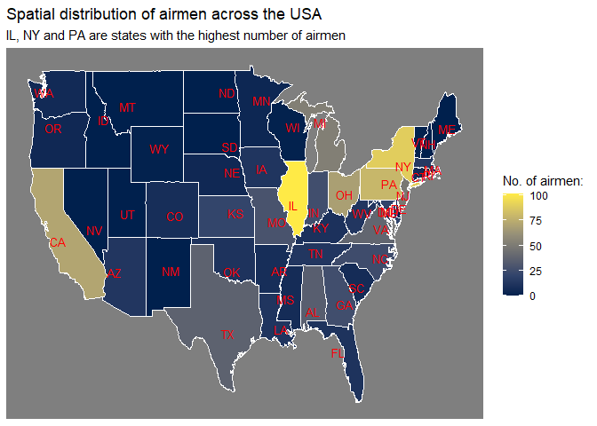
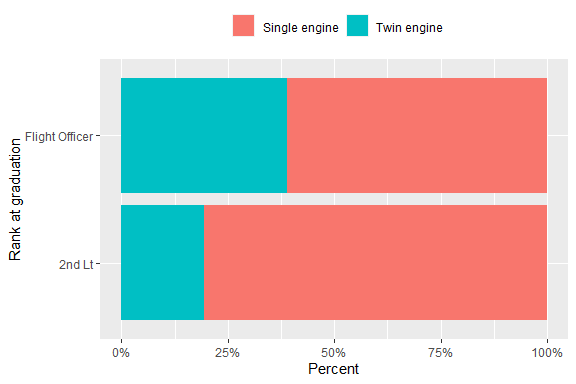
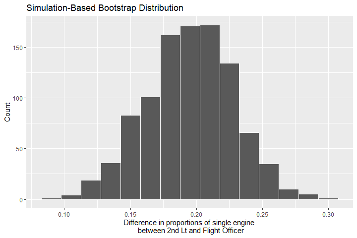
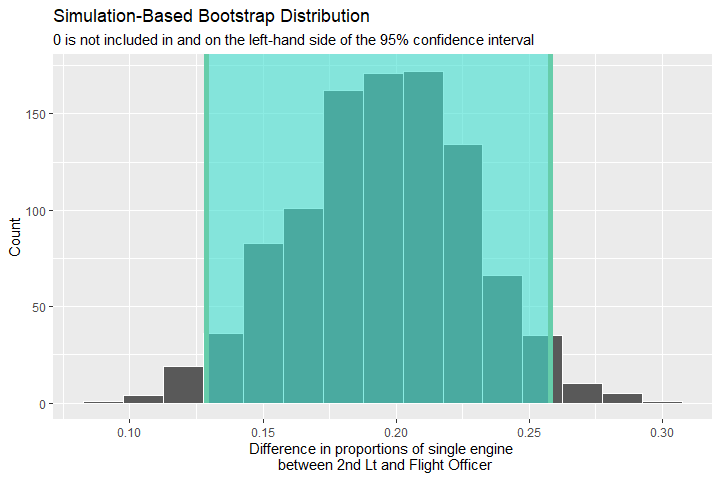
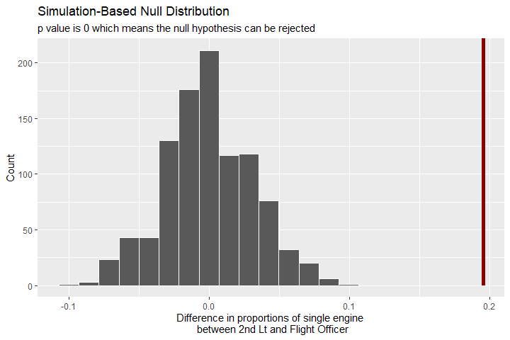

## **Introduction**

This work is inspired by **R Data Science: Tidy Tuesday**. This week's topic is about Tuskegee Airmen. The data can be accessed via **[this link](https://raw.githubusercontent.com/rfordatascience/tidytuesday/master/data/2022/2022-02-08/airmen.csv)**.

The work will answer two questions related to:  

  1. Spatial distribution of airmen across the US  
  2. Correlation between the graduation rank and the type of pilot
  
The content is listed below:  

  1. Introduction
  2. Getting the data  
  3. Understanding the data
  4. Performing exploratory data analysis  
  5. Conclusion


## **Getting the data**

Load packages

```r
library(tidyverse)
library(tidymodels)
library(lubridate)
library(knitr)
```

Download and read in the data 

```r
if (!file.exists("data")) {
  dir.create("data")
}

if (!file.exists("./data/airmen.csv")) {
  url = "https://raw.githubusercontent.com/rfordatascience/tidytuesday/master/data/2022/2022-02-08/airmen.csv"
  download.file(url, destfile = "./data/airmen.csv")
}

airmen_raw <- read_csv("./data/airmen.csv")
```

## **Understand the data**

Let's take a look at the data using `View(airmen_raw)`.

***Comment:*** The data set has 1006 rows and 16 columns.

#### **Column `name`:**

Check if there is any duplicated name in the data

```r
airmen_raw$name[duplicated(airmen_raw$name)] %>% 
  writeLines()
```

```
Brothers, James E.
Walker, William H.
Watkins, Edward W.
```

***Comment:*** There are 3 names which appears at least twice in the data.  

Take a look at other pieces of information related to these 3 airmen

```r
airmen_raw %>% 
  filter(name %in% airmen_raw$name[duplicated(airmen_raw$name)]) %>% 
  select(name, graduation_date, rank_at_graduation) %>% 
  kable()
```


|name               |graduation_date |rank_at_graduation |
|:------------------|:---------------|:------------------|
|Brothers, James E. |1944-08-04      |Flight Officer     |
|Brothers, James E. |1943-04-29      |2nd Lt             |
|Walker, William H. |1942-12-13      |2nd Lt             |
|Walker, William H. |1943-02-16      |2nd Lt             |
|Watkins, Edward W. |1945-09-08      |Flight Officer     |
|Watkins, Edward W. |1943-10-01      |2nd Lt             |

***Comment:*** There are 2 cases in which the airmen graduated as `2nd Lieutenant` and then as `Flight Officer`, which probably implies that `Flight Officer` is higher in rank than `2nd Lieutenant`. The other case seems somewhat strange when the airman graduated as `2nd Lieutenant` twice.  

#### **Column `graduation_date`:**

Create a column named `graduated_year` which is the year of the column named `graduation_date`

```r
airmen_raw <- airmen_raw %>%
  mutate(graduated_year = year(graduation_date))
```

Count the number of airmen graduated in each year.

```r
airmen_raw %>% 
  count(graduated_year, sort = TRUE)
```

```
# A tibble: 7 x 2
  graduated_year     n
           <dbl> <int>
1           1944   369
2           1943   273
3           1945   241
4           1942    63
5           1946    39
6             NA    11
7           1948    10
```

***Comment:***  
  - The year of `1947` is absent from the list.  
  - There are 11 `NA` values.  
  - A vast majority of airmen graduated from `1943` to `1945`.  

#### **Column `rank_at_graduation`:**

ount the occurrence of each rank at graduation.

```r
airmen_raw %>% 
  count(rank_at_graduation, sort = TRUE)
```

```
# A tibble: 8 x 2
  rank_at_graduation     n
  <chr>              <int>
1 2nd Lt               688
2 Flight Officer       279
3 1st Lt                28
4 <NA>                   5
5 N/A                    2
6 Unk                    2
7 Capt                   1
8 Captain                1
```

***Comment:***  
  - `Capt` and `Captain` can be grouped.  
  - `N/A`, `Unk` and `NA` can be grouped.  
  - `2nd Lt`, `Flight Officer` and `1st Lt` are dominant ranks.  

#### **Column `graduated_from`:**

Count the number of places where airmen graduated.

```r
airmen_raw %>% 
  count(graduated_from, sort = TRUE)
```

```
# A tibble: 4 x 2
  graduated_from              n
  <chr>                   <int>
1 TAAF                      993
2 Williams AFB, AZ           10
3 Stewart Field, NY           2
4 Enid Army Air Field, Ok     1
```

***Comment:*** TAFF is the absolutely most common.  

#### **Column `pilot_type`:**

Count the occurrence of each pilot type.

```r
airmen_raw %>% 
  count(pilot_type, sort = TRUE)
```

```
# A tibble: 5 x 2
  pilot_type        n
  <chr>         <int>
1 Single engine   697
2 Twin engine     247
3 Liaison pilot    50
4 Service pilot    11
5 Liason pilot      1
```

***Comment:***  
  - `Liaison pilot` and `Liason pilot` can be grouped.  
  - `Single engine` and `Twin engine` are the most common types.  
  
#### **Column `state`:**

Count the occurrence of states where airmen were in charge.

```r
airmen_raw %>% 
  count(state, sort = TRUE)
```

```
# A tibble: 49 x 2
   state     n
   <chr> <int>
 1 IL      102
 2 NY       90
 3 PA       80
 4 CA       72
 5 OH       69
 6 MI       53
 7 NJ       49
 8 VA       39
 9 DC       37
10 TX       37
# ... with 39 more rows
```

***Comment:***  
  - There are 49 states in total.  
  - `NA` and `Unk` can be grouped.  
  - `Haiti` and `HT` can be grouped.  
  - `In` and `IN` can be grouped.  
  - There are some states not in the US.  
  - There are some states of the US not present on the list.  

#### **Column `number_of_aerial_victory_credits`:**

Arrange airmen on the basis of the number of aerial victory credits.

```r
airmen_raw %>% 
  arrange(desc(number_of_aerial_victory_credits)) %>% 
  select(name, number_of_aerial_victory_credits)
```

```
# A tibble: 1,006 x 2
   name                   number_of_aerial_victory_credits
   <chr>                                             <dbl>
 1 Archer, Lee A.                                        4
 2 Elsberry, Joseph D.                                   4
 3 Toppins, Edward L.                                    4
 4 Hall, Charles B.                                      3
 5 Jackson, Leonard M.                                   3
 6 Lester, Clarence D.                                   3
 7 Pruitt, Wendell O.                                    3
 8 Romine, Roger                                         3
 9 Stewart, Harry T., Jr.                                3
10 Bailey, Charles P.                                    2
# ... with 996 more rows
```

***Comment:***  
  - The maximum number of credits is 4.  
  - There are 72 airmen with at least 1 credit.  
  - The number of credits is not always a whole number (e.g. 1.5).  

#### **Other columns:**
  
As can be seen from `View(airmen_raw)`, a lot of entries in `reported_lost`, `reported_lost_data` and `reported_lost_location` are `NA` values. Therefore, we can check how many and which entries are not `NA` values.

```r
sum(!is.na(airmen_raw$reported_lost))
```

```
[1] 2
```

```r
sum(!is.na(airmen_raw$reported_lost_date))
```

```
[1] 2
```

```r
sum(!is.na(airmen_raw$reported_lost_location))
```

```
[1] 2
```

***Comment:*** All 3 previous mentioned columns have only 2 entries which are not `NA` values.  

Let's see what these 2 observations are.

```r
airmen_raw %>% 
  filter(!is.na(reported_lost)) %>% 
  select(name, contains("lost"))
```

```
# A tibble: 2 x 4
  name               reported_lost reported_lost_date  reported_lost_location 
  <chr>              <chr>         <dttm>              <chr>                  
1 McCullin, James L. Y             1943-07-02 00:00:00 Over SW coast of Sicily
2 White, Sherman W.  Y             1943-07-02 00:00:00 Over SW coast of Sicily
```

***Comment:*** The location and the time are the same for the two airmen.  

## **Cleaning the data**

Using all comments in the section of **Understanding the data**, we have a list of preprocessing steps below.

```r
airmen <- airmen_raw %>%
  mutate(rank_at_graduation = case_when(
    rank_at_graduation == "Capt" ~ "Captain",
    is.na(rank_at_graduation) | rank_at_graduation == "N/A" | rank_at_graduation == "Unk" ~ "Unknown",
    TRUE ~ rank_at_graduation
    )
  ) %>% 
  mutate(pilot_type = case_when(
    pilot_type == "Liason pilot" ~ "Liaison pilot",
    TRUE ~ pilot_type
    )
  ) %>% 
  mutate(state = case_when(
    is.na(state) | state == "Unk" ~ "Unknown",
    state == "Haiti" ~ "HT",
    state == "In" ~ "IN",
    TRUE ~ state
    )
  )
```

## **Performing exploratory data analysis** 

### **Question 1:**

We would like to have an idea on spatial Distribution of airmen across the US.  

```r
airmen_vs_states <- airmen %>% 
  count(state)
airmen_vs_states
```

```
# A tibble: 46 x 2
   state     n
   <chr> <int>
 1 AL       35
 2 AR        8
 3 AZ       13
 4 CA       72
 5 CN        1
 6 CO        8
 7 CT        7
 8 DC       37
 9 DE        2
10 FL       11
# ... with 36 more rows
```

#### **Wrangling data**

We need to prepare a data set which contains information on state abbreviations of the US, state's longitude and latitude and the number of airmen in charge.  

```r
# The data frame has each state's full name and its geographic location
states_map <- map_data("state") %>% 
  as_tibble()

# The data frame has each state's full name and its abbreviation
states_name_and_abb <- tibble(
  state_name = c(state.name %>% str_to_lower(), "district of columbia"),
  state_abb = c(state.abb, "DC")
)

# The data frame has each state's full name, its abbreviation and its geographic location
states_map <- states_map %>% 
  left_join(states_name_and_abb, by = c("region" = "state_name"))

# The data frame has each state's abbreviation and its label position on the following visualization
states_abb_labels <- states_map %>% 
  group_by(state_abb) %>% 
  summarise(mean_long = mean(long),
            mean_lat = mean(lat))

# The data frame has all information required
airmen_vs_states <- airmen_vs_states %>% 
  right_join(states_map, by = c("state" = "state_abb")) %>% 
  mutate(n = replace_na(n, 0))
```

#### **Visualizing**

The visualization below show the spatial distribution of airmen across the US.   

```r
airmen_vs_states %>% 
  ggplot(aes(x = long, y = lat)) +
  geom_polygon(aes(fill = n, group = group), color = "white") +
  geom_text(aes(x = mean_long, y = mean_lat, label = state_abb), 
            data = states_abb_labels,
            size = 3.5, hjust = 0.5, color = "red") +
  scale_fill_viridis_c(option = "E") +
  labs(x = NULL,
       y = NULL,
       title = "Spatial distribution of airmen across the USA",
       subtitle = "IL, NY and PA are states with the highest number of airmen",
       fill = "No. of airmen:") +
  theme_dark() +
  scale_x_continuous(labels = NULL, breaks = NULL) +
  scale_y_continuous(labels = NULL, breaks = NULL)
```



***Comment:*** It can be seen from the map that the north-east regions of the US are the hot spots for Tuskegee airmen.   

### **Question 2:**

We would like to know if the rank at graduation and the type of pilot have any correlation **in general**.

```r
grad_rank <- c("2nd Lt", "Flight Officer")
pilot <- c("Single engine", "Twin engine")
```

First, take a look at the contingency table between the rank at graduation and the type of pilot from the data set.

```r
airmen %>% 
  filter(rank_at_graduation %in% grad_rank,
         pilot_type %in% pilot) %>% 
  count(rank_at_graduation, pilot_type) %>% 
  pivot_wider(names_from = pilot_type, values_from = n)
```

```
# A tibble: 2 x 3
  rank_at_graduation `Single engine` `Twin engine`
  <chr>                        <int>         <int>
1 2nd Lt                         522           125
2 Flight Officer                 165           105
```

Consider what proportion of each graduation rank ride `Single engine` plane.

```r
airmen %>% 
  filter(rank_at_graduation %in% grad_rank,
         pilot_type %in% pilot) %>% 
  ggplot(aes(rank_at_graduation, fill = pilot_type)) +
  geom_bar(position = "fill") +
  scale_y_continuous(labels = scales::percent_format()) +
  labs(x = "Rank at graduation", y = "Percent", fill = NULL) +
  theme(legend.position = "top") +
  coord_flip()
```



***Comment:*** It is pretty clear that **in general** airmen with the rank of `2nd Lt` are more likely to ride a plane with the type of `Single engine`.  

There are 2 ways to verify this generalized claim:  
  1. Use simulation-based confidence interval  
  2. Use hypothesis testing  
These 2 ways can be completed using the `infer` package

#### **Wrangling data**

Get the data prepared for the two approaches.

```r
grad_rank_vs_pilot <- airmen %>% 
  filter(rank_at_graduation %in% grad_rank,
         pilot_type %in% pilot) %>% 
  select(rank_at_graduation, pilot_type)
```

Get the observed difference in the proportion of `2nd Lt` and `Flight Officer` airmen who ride a `Single engine` plane.

```r
observed_diff_props <- grad_rank_vs_pilot %>% 
  specify(pilot_type ~ rank_at_graduation, success = "Single engine") %>% 
  calculate(stat = "diff in props", order = grad_rank)
observed_diff_props
```

```
Response: pilot_type (factor)
Explanatory: rank_at_graduation (factor)
# A tibble: 1 x 1
   stat
  <dbl>
1 0.196
```

#### **Simulation-based confidence interval**

A bootstrap distribution will be created using 1000 replicates.  

```r
set.seed(12345)
bootstrap_dist <- grad_rank_vs_pilot %>% 
  specify(pilot_type ~ rank_at_graduation, success = "Single engine") %>% 
  generate(reps = 1000, type = "bootstrap") %>% 
  calculate(stat = "diff in props", order = grad_rank)
```

A visualization of the bootstrap is shown below.  

```r
bootstrap_dist %>% 
  visualize() +
  labs(x = "Difference in proportions of single engine \n between 2nd Lt and Flight Officer",
       y = "Count")
```



We can get 95% confidence interval using percentile method from the bootstrap distribution.

```r
percentile_ci <- bootstrap_dist %>% 
  get_ci(type = "percentile")
percentile_ci
```

```
# A tibble: 1 x 2
  lower_ci upper_ci
     <dbl>    <dbl>
1    0.129    0.258
```

A visualization of the bootstrap distribution with 95% confidence interval is shown below.

```r
bootstrap_dist %>% visualize() + 
  shade_ci(percentile_ci) +
  labs(x = "Difference in proportions of single engine \n between 2nd Lt and Flight Officer",
       y = "Count",
       subtitle = "0 is not included in and on the left-hand side of the 95% confidence interval")
```



***Comment:*** The whole interval is above 0 which means that we are 95% confident that `2nd Lt` are more likely to ride a plane with the type of `Single engine` **in general**.  

#### **Hypothesis testing**  

***Note:*** We set the significance level of 0.05.  

A null distribution will be created using 1000 replicates.  

```r
set.seed(12345)
null_dist <- grad_rank_vs_pilot %>% 
  specify(pilot_type ~ rank_at_graduation, success = "Single engine") %>% 
  hypothesise(null = "independence") %>% 
  generate(reps = 1000, type = "permute") %>% 
  calculate(stat = "diff in props", order = grad_rank)
```

The p-value is shown below.  

```r
p_value <- null_dist %>%
  get_p_value(observed_diff_props, "right")
p_value
```

```
# A tibble: 1 x 1
  p_value
    <dbl>
1       0
```

A visualization of the null distribution with the observed data point is shown below.  

```r
null_dist %>% 
  visualize() + 
  shade_p_value(observed_diff_props, "right", color = "darkred") +
  labs(x = "Difference in proportions of single engine \n between 2nd Lt and Flight Officer",
       y = "Count",
       subtitle = "p value is 0 which means the null hypothesis can be rejected")
```



***Comment:*** p-value is 0 which means that we reject the null hypothesis. In other words, `2nd Lt` are more likely to ride a plane with the type of `Single engine` **in general**.

## **Conclusion**

  1. It can be seen from the map that the north-east regions of the US and California are the hot spots for Tuskegee airmen.  
  2. We are 95% confident that `2nd Lt` are more likely to ride a plane with the type of `Single engine` than `Flight Officer` is **in general**.  
