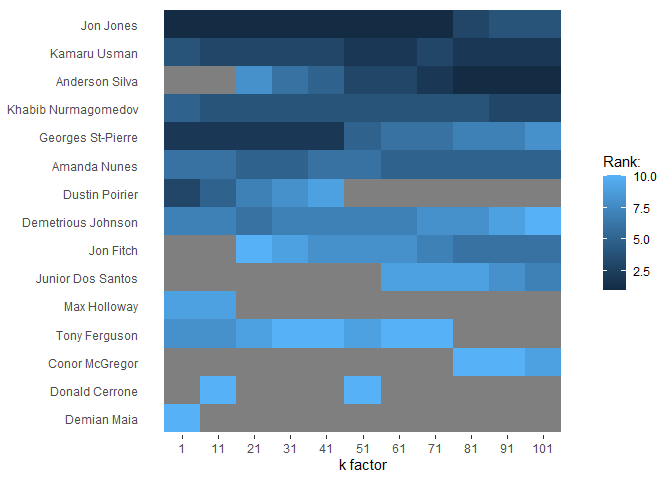
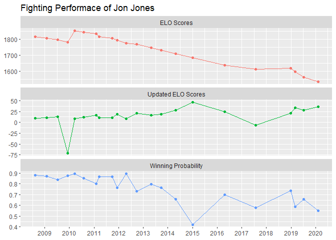
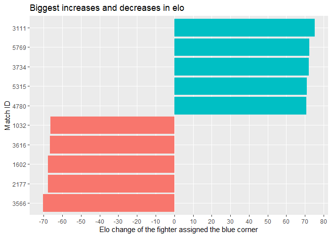

## **1. Introduction**

This work is inspired and instructed by **[Andrew Couch](https://github.com/andrew-couch)**. I would like to express my deepest appreciation to him. The topic is about UFC Match History. The data can be accessed via **[this link](https://www.kaggle.com/rajeevw/ufcdata)**.

The work focuses on cleaning data, performing exploratory analysis, building and tweaking a model and further performing exploratory analysis. Codes used for this work can be found in **[my github](https://github.com/tmhuy0510/Tidy_Tuesday/tree/main/Tidytuesday_2022_03_08)**.  

There are 3 main questions will be answered:  

  1. How to calculate ELO scores for UFC fighters after their matches  
  2. How to predict the probability that a fighter wins his/her opponent  
  3. What match are biggest upsets in UFC history  
  
The content is listed below:  

  1. Introduction  
  2. Getting and understanding the data  
  3. Tidying the data  
  4. Building an ELO model  
  5. Tweaking the ELO model's K factor  
  6. Performing further EDA  

## **2. Getting and understanding the data**

Load packages 

```r
library(tidyverse)
library(elo)
```

Read in the data set

```r
ufc_raw <- read_csv("./data/ufc.csv")
```

Have a look at the structure of the data set using `View()` and `dim()`

```r
View(ufc_raw)
dim(ufc_raw)
```
***Comment:*** The data set has 6012 rows and 144 columns.

Have a look at the features of the data set

```r
ufc_raw %>% colnames()
```

```
  [1] "R_fighter"                    "B_fighter"                   
  [3] "Referee"                      "date"                        
  [5] "location"                     "Winner"                      
  [7] "title_bout"                   "weight_class"                
  [9] "B_avg_KD"                     "B_avg_opp_KD"                
 [11] "B_avg_SIG_STR_pct"            "B_avg_opp_SIG_STR_pct"       
 [13] "B_avg_TD_pct"                 "B_avg_opp_TD_pct"            
 [15] "B_avg_SUB_ATT"                "B_avg_opp_SUB_ATT"           
 [17] "B_avg_REV"                    "B_avg_opp_REV"               
 [19] "B_avg_SIG_STR_att"            "B_avg_SIG_STR_landed"        
 [21] "B_avg_opp_SIG_STR_att"        "B_avg_opp_SIG_STR_landed"    
 [23] "B_avg_TOTAL_STR_att"          "B_avg_TOTAL_STR_landed"      
 [25] "B_avg_opp_TOTAL_STR_att"      "B_avg_opp_TOTAL_STR_landed"  
 [27] "B_avg_TD_att"                 "B_avg_TD_landed"             
 [29] "B_avg_opp_TD_att"             "B_avg_opp_TD_landed"         
 [31] "B_avg_HEAD_att"               "B_avg_HEAD_landed"           
 [33] "B_avg_opp_HEAD_att"           "B_avg_opp_HEAD_landed"       
 [35] "B_avg_BODY_att"               "B_avg_BODY_landed"           
 [37] "B_avg_opp_BODY_att"           "B_avg_opp_BODY_landed"       
 [39] "B_avg_LEG_att"                "B_avg_LEG_landed"            
 [41] "B_avg_opp_LEG_att"            "B_avg_opp_LEG_landed"        
 [43] "B_avg_DISTANCE_att"           "B_avg_DISTANCE_landed"       
 [45] "B_avg_opp_DISTANCE_att"       "B_avg_opp_DISTANCE_landed"   
 [47] "B_avg_CLINCH_att"             "B_avg_CLINCH_landed"         
 [49] "B_avg_opp_CLINCH_att"         "B_avg_opp_CLINCH_landed"     
 [51] "B_avg_GROUND_att"             "B_avg_GROUND_landed"         
 [53] "B_avg_opp_GROUND_att"         "B_avg_opp_GROUND_landed"     
 [55] "B_avg_CTRL_time(seconds)"     "B_avg_opp_CTRL_time(seconds)"
 [57] "B_total_time_fought(seconds)" "B_total_rounds_fought"       
 [59] "B_total_title_bouts"          "B_current_win_streak"        
 [61] "B_current_lose_streak"        "B_longest_win_streak"        
 [63] "B_wins"                       "B_losses"                    
 [65] "B_draw"                       "B_win_by_Decision_Majority"  
 [67] "B_win_by_Decision_Split"      "B_win_by_Decision_Unanimous" 
 [69] "B_win_by_KO/TKO"              "B_win_by_Submission"         
 [71] "B_win_by_TKO_Doctor_Stoppage" "B_Stance"                    
 [73] "B_Height_cms"                 "B_Reach_cms"                 
 [75] "B_Weight_lbs"                 "R_avg_KD"                    
 [77] "R_avg_opp_KD"                 "R_avg_SIG_STR_pct"           
 [79] "R_avg_opp_SIG_STR_pct"        "R_avg_TD_pct"                
 [81] "R_avg_opp_TD_pct"             "R_avg_SUB_ATT"               
 [83] "R_avg_opp_SUB_ATT"            "R_avg_REV"                   
 [85] "R_avg_opp_REV"                "R_avg_SIG_STR_att"           
 [87] "R_avg_SIG_STR_landed"         "R_avg_opp_SIG_STR_att"       
 [89] "R_avg_opp_SIG_STR_landed"     "R_avg_TOTAL_STR_att"         
 [91] "R_avg_TOTAL_STR_landed"       "R_avg_opp_TOTAL_STR_att"     
 [93] "R_avg_opp_TOTAL_STR_landed"   "R_avg_TD_att"                
 [95] "R_avg_TD_landed"              "R_avg_opp_TD_att"            
 [97] "R_avg_opp_TD_landed"          "R_avg_HEAD_att"              
 [99] "R_avg_HEAD_landed"            "R_avg_opp_HEAD_att"          
[101] "R_avg_opp_HEAD_landed"        "R_avg_BODY_att"              
[103] "R_avg_BODY_landed"            "R_avg_opp_BODY_att"          
[105] "R_avg_opp_BODY_landed"        "R_avg_LEG_att"               
[107] "R_avg_LEG_landed"             "R_avg_opp_LEG_att"           
[109] "R_avg_opp_LEG_landed"         "R_avg_DISTANCE_att"          
[111] "R_avg_DISTANCE_landed"        "R_avg_opp_DISTANCE_att"      
[113] "R_avg_opp_DISTANCE_landed"    "R_avg_CLINCH_att"            
[115] "R_avg_CLINCH_landed"          "R_avg_opp_CLINCH_att"        
[117] "R_avg_opp_CLINCH_landed"      "R_avg_GROUND_att"            
[119] "R_avg_GROUND_landed"          "R_avg_opp_GROUND_att"        
[121] "R_avg_opp_GROUND_landed"      "R_avg_CTRL_time(seconds)"    
[123] "R_avg_opp_CTRL_time(seconds)" "R_total_time_fought(seconds)"
[125] "R_total_rounds_fought"        "R_total_title_bouts"         
[127] "R_current_win_streak"         "R_current_lose_streak"       
[129] "R_longest_win_streak"         "R_wins"                      
[131] "R_losses"                     "R_draw"                      
[133] "R_win_by_Decision_Majority"   "R_win_by_Decision_Split"     
[135] "R_win_by_Decision_Unanimous"  "R_win_by_KO/TKO"             
[137] "R_win_by_Submission"          "R_win_by_TKO_Doctor_Stoppage"
[139] "R_Stance"                     "R_Height_cms"                
[141] "R_Reach_cms"                  "R_Weight_lbs"                
[143] "B_age"                        "R_age"                       
```

```r
ufc_raw %>% colnames() %>% str_count("^B_") %>% sum()
```

```
[1] 69
```

```r
ufc_raw %>% colnames() %>% str_count("^B_") %>% sum()
```

```
[1] 69
```

```r
ufc_raw %>% colnames() %>% str_count("^[^RB]|^R[^_]|^B[^_]") %>% sum()
```

```
[1] 6
```
***Comment:***  
  1. B and R prefixes stand for Blue and Red respectively.  
  2. There are 69 features for B and 69 features for R.  
  3. There are 6 shared features for both B and R: `Referee`, `date`, `location`, `Winner`, `title_bout`, `weight_class`.  

Let's see if there is winning chance of fighters at the red and blue corners

```r
ufc_raw %>% count(Winner)
```

```
# A tibble: 3 x 2
  Winner     n
  <chr>  <int>
1 Blue    1923
2 Draw     110
3 Red     3979
```
***Comment:*** Fighters at the red corner have a higher winning chance.  

As for non-title bouts, newer fighters are likely to be assigned the blue corner. As for title bouts, challengers are likely to be assigned the blue corner.  

## **3. Tidying the data**

Before we move onto the further exploratory analysis, we add a primary key to the data set

```r
ufc_raw <- ufc_raw %>%
  mutate(match_id = row_number())
```
***Comment:*** This primary key will become useful if we split the data set into several parts for data transformation in the column wise manner and then join the transformed parts.  

Each observation of the data set is a match of 2 fighters. We would like to make a tidy data set of which each observation is a fighter in a match.  

To do this, we split the original data set into 2 data sets each of which represents observations for fighters at the blue corner or red corner.

```r
r_df <- ufc_raw %>% select(-starts_with("B_")) # Notice the minus sign
b_df <- ufc_raw %>% select(-starts_with("R_")) # Notice the minus sign
```
***Comment:*** Each data set should have 76 columns.

To calculate ELO scores of UFC fighters, we will use the `elo` package. For more information on this package, it is recommended to refer to its vignette.  

The `elo.run` function of the `elo` package basically requires 3 arguments:  

  1. `formula`: A formula with at least 3 components: `Winner ~ Team_A + Team_B`  
    1.1. `Team_A`: a character vector containing the name of Team A  
    1.2. `Team_B`: a character vector containing the name of Team B  
    1.3. `Winner`: a numeric vector containing `0` if Team A loses, `0.5` if Team A draws or `1` if Team A wins  
  2. `data`: A data set of which each observation is a match  
  3. `k`: K factor of which a higher value means the sooner effect of the match result on the ranking system  

We need to change values of `Winner` column of `r_df` and `b_df` to 0, 0.5 or 1.

```r
r_df <- r_df %>% mutate(Winner = case_when(
  Winner == "Red" ~ 1,
  Winner == "Blue" ~ 0,
  TRUE ~ 0.5
))
b_df <- b_df %>% mutate(Winner = case_when(
  Winner == "Red" ~ 0,
  Winner == "Blue" ~ 1,
  TRUE ~ 0.5
))
```

Next, we remove all prefixes `R_` and `B_` from the column names of the 2 data sets.

```r
r_df <- r_df %>% 
  rename_all(.funs = function(x) str_replace(x, "R_", ""))
b_df <- b_df %>% 
  rename_all(.funs = function(x) str_replace(x, "B_", ""))
# Check if these 2 data sets have all the same column names in pair
all(colnames(r_df) == colnames(b_df))
```

```
[1] TRUE
```
***Comment:*** All the column names of 2 data sets are the same in pair.  

Now we can combine the 2 data sets in the row wise manner to get a tidy data set.

```r
tidy_df <- bind_rows(r_df, b_df)
dim(tidy_df)
```

```
[1] 12024    76
```
***Comment:*** The data set should have 6012 x 2 = 12024 rows and 76 columns.  

We can save this data set as an R object for future uses.

```r
saveRDS(tidy_df, "./r_objects/tidy_ufc.rds")
```

## **4. Building an ELO model**

Because the `data` argument of the `elo.run` function requires the data set of which each observation is a match, we will use the original data set `ufc_raw` with modifications on the values of the `Winner` column.  

```r
elo_df <- ufc_raw %>% select(match_id, 1:8) %>%
  rename(fighter = "R_fighter",
         opponent = "B_fighter") %>% 
  mutate(Winner = case_when(
    Winner == "Red" ~ 1,
    Winner == "Blue" ~ 0,
    TRUE ~ 0.5
  ))
saveRDS(elo_df, "./r_objects/elo_df.rds")
```

Now we can calculate all information related to ELO scores

```r
elo_fighter <- elo.run(Winner ~ fighter + opponent,
                       data = elo_df,
                       k = 20)
elo_fighter
```

```

An object of class 'elo.run', containing information on 2139 teams and 6012 matches.
```
***Comment:*** The value of K factor is initially chosen to be 20 because this value is suitable for NBA. Later on, the value of K factor will be tweaked to make it suitable for UFC.  

We can get the rankings of all fighters using their ELO scores.

```r
elo_fighter_rank <- elo_fighter %>% 
  rank.teams() %>% 
  tibble(names = names(.),
         ranking = .) %>% 
  arrange(ranking)
head(elo_fighter_rank)
```

```
# A tibble: 6 x 2
  names               ranking
  <chr>                 <int>
1 Jon Jones                 1
2 Georges St-Pierre         2
3 Kamaru Usman              3
4 Khabib Nurmagomedov       4
5 Amanda Nunes              5
6 Demetrious Johnson        6
```
***Comment:*** Jon Jones is ranked as No.1 of all time.  

## **5. Tweaking the ELO model's K factor**

We will now examine how K factor affects the ranking system.  

First we create a helper function which returns a list of top 10 fighters using the `elo.run` function and an entered value of `k`.

```r
k_sensitivity <- function(k){
  results <- elo.run(Winner ~ fighter + opponent, 
                     k = k,
                     data = elo_df)
  
  results %>% 
    rank.teams() %>% 
    tibble(names = names(.),
           ranking = .) %>% 
    filter(ranking <= 10) %>% 
    arrange(ranking)
}
```

Next we create a data frame with each row contains a value of k and a corresponding list of top 10 fighters and then unnest it.

```r
k_rankings <- tibble(k = seq(1, 101, by = 10)) %>% 
  mutate(top_10_rankings = map(k, k_sensitivity)) %>% 
  unnest(top_10_rankings)
```

Finally, we plot a heatmap using k values, fighters and their rankings.It should be noticed that depending on k values, some fighters may be present or not on the list of top 10.

```r
k_rankings %>% 
  complete(k, names) %>% 
  group_by(names) %>% 
  mutate(avg_ranking = mean(ranking, na.rm = TRUE)) %>% 
  ggplot(aes(k, reorder(names, -avg_ranking))) +
  geom_tile(aes(fill = ranking)) +
  scale_x_continuous(breaks = seq(1, 101, by = 10), 
                     minor_breaks = NULL) +
  labs(x = "k factor", y = NULL, fill = "Rank:") +
  theme(panel.background = element_rect(fill = "white"),
        axis.ticks.y = element_blank())
```


***Comment:***  
  1. Some fighters may be present or not on the list of top 10 depending on k values.  
  2. It is reasonable to pick k from 61 to 81. In this case, we will use **k = 81**.  

## **6. Performing further EDA**

It would make more sense if we could return a list of top 10 fighters within a certain weight class as opposed to the overall. To accomplish this, we will create a helper function.

```r
top_10_elo_by_weight_class <- function(df) {
  elo.run(Winner ~ fighter + opponent,
          k = 81,
          data = df) %>% 
    rank.teams() %>% 
    tibble(names = names(.),
           ranking = .) %>% 
    arrange(ranking) %>% 
    slice(1:10)
}
```

Now we can get a data frame containing top 10 fighters within each weight class. The data frame shown below is for the case of `"Lightweight"`.

```r
top_10_fighters_by_weight_class <- elo_df %>% 
  group_by(weight_class) %>% 
  nest() %>% 
  mutate(data = map(data, top_10_elo_by_weight_class)) %>% 
  unnest(cols = c(data))
top_10_fighters_by_weight_class %>% 
  filter(weight_class == "Lightweight")
```

```
# A tibble: 10 x 3
# Groups:   weight_class [1]
   weight_class names               ranking
   <chr>        <chr>                 <int>
 1 Lightweight  Khabib Nurmagomedov       1
 2 Lightweight  Donald Cerrone            2
 3 Lightweight  Tony Ferguson             3
 4 Lightweight  Dustin Poirier            4
 5 Lightweight  Michel Prazeres           5
 6 Lightweight  Jim Miller                6
 7 Lightweight  Benson Henderson          7
 8 Lightweight  Frankie Edgar             8
 9 Lightweight  Gray Maynard              9
10 Lightweight  James Vick               10
```

### **Question 1: How to calculate ELO scores for UFC fighters after their matches**

We can also create a data frame containing information about how ELO scores and other parameters changed for each match.

```r
elo_history <- elo_df %>% 
  elo.run(Winner ~ fighter + opponent, data = ., k = 81) %>% 
  as_tibble() %>% 
  rename("fighter" = 1, "opponent" = 2, 
         "fighter_prob" = 3, "fighter_wins" = 4, 
         "fighter_elo_change" = 5, "opponent_elo_change" = 6, 
         "fighter_elo" = 7, "opponent_elo" = 8) %>% 
  mutate(match_id = elo_df$match_id,
         weight_class = elo_df$weight_class,
         date = elo_df$date) %>% 
  arrange(weight_class, match_id)
elo_history %>% sample_n(size = 1) %>% glimpse()
```

```
Rows: 1
Columns: 11
$ fighter             <fct> Martin Bravo
$ opponent            <fct> Claudio Puelles
$ fighter_prob        <dbl> 0.2503706
$ fighter_wins        <dbl> 1
$ fighter_elo_change  <dbl> 60.71999
$ opponent_elo_change <dbl> -60.71999
$ fighter_elo         <dbl> 1446.515
$ opponent_elo        <dbl> 1515.58
$ match_id            <int> 2131
$ weight_class        <chr> "Lightweight"
$ date                <date> 2016-11-05
```

In stead of letting each observation of `elo_history` represent a match, we create a tidy data frame named `tidy_elo_history` of which each observation represents a fighter.

```r
# Data frame for a fighter
fighter_elo_history <- elo_history %>% 
  select(fighter, match_id, date, weight_class, 
         fighter_prob, fighter_wins, fighter_elo_change, fighter_elo)
# Data frame for an opponent
opponent_elo_history <- elo_history %>% 
  select(opponent, match_id, date, weight_class, 
         fighter_prob, fighter_wins, opponent_elo_change, opponent_elo) %>% 
  mutate(fighter_prob = 1 - fighter_prob,
         fighter_wins = 1 - fighter_wins) %>% 
  rename_all(.funs = function(x) str_replace(x, "opponent", "fighter"))
# Combine 2 previous data frames in a row wise manner
tidy_elo_history <- bind_rows(fighter_elo_history, opponent_elo_history)
# Save this tidy data frame for future uses
saveRDS(tidy_elo_history, "./r_objects/tidy_elo_history.rds")
```

Using the tidy data frame `tidy_elo_history`, we can create plots showing the change of ELO scores and other parameters for a fighter. In this case, **Jon Jones** will be chosen.

```r
tidy_elo_history %>% 
  filter(fighter == "Jon Jones") %>%
  rename("ELO Scores" = fighter_elo,
         "Winning Probability" = fighter_prob,
         "Updated ELO Scores" = fighter_elo_change) %>% 
  pivot_longer(c(`ELO Scores`, 
                 `Winning Probability`, 
                 `Updated ELO Scores`),
               names_to = "elo_para",
               values_to = "value") %>% 
  ggplot(aes(date, value, color = elo_para)) +
  geom_line(show.legend = FALSE) +
  geom_point(show.legend = FALSE) +
  facet_wrap(vars(elo_para), nrow = 3, scales = "free_y") +
  scale_x_date(date_breaks = "1 year", date_labels = "%Y") +
  labs(x = NULL, y = NULL, 
       title = "Fighting Performace of Jon Jones")
```


***Comment:***  
  1. Jon Jones got beaten only 1 time.  
  2. We used `tidy_elo_history` to make a plot instead of `elo_history` because a fighter is not always assigned at blue corner. It should be noted that if we had used `elo_history`, we would have not see a lost experienced by Jon Jones.  
  
### **Question 2: How to predict the probability that a fighter wins his/her opponent**

We can naively predict the probability that a fighter beats his/her opponent. Let's see how this works for the match **Khabib Nurmagomedov** vs. **Conor McGregor**.

```r
elo.run(Winner ~ fighter + opponent,
        data = elo_df,
        k = 81) %>% 
  predict(newdata = tibble(fighter = "Khabib Nurmagomedov", 
                           opponent = "Conor McGregor"))
```

```
[1] 0.5815712
```
***Comment:*** Khabib Nurmagomedov is favored to be the winner of the match. This actually happened.  

Moreover, we can see what matches have biggest ELO change for fighters or matches have biggest upsets.

```r
elo_history %>% 
  group_by(fighter_elo_change > 0) %>% 
  slice_max(abs(fighter_elo_change), n = 5) %>% 
  ggplot(aes(x = fighter_elo_change, 
             y = reorder(as_factor(match_id), fighter_elo_change), 
             fill = fighter_elo_change > 0)) +
  geom_col(show.legend = FALSE) +
  scale_x_continuous(breaks = seq(-70, 80, by = 10), 
                     minor_breaks = NULL) +
  labs(x = "Elo change of the fighter assigned the blue corner",
       y = "Match ID",
       title = "Biggest increases and decreases in elo")
```



### **Question 3: What match are biggest upsets in UFC history**

We can drill further down into these biggest upsets to find out who were the fighters.

```r
elo_history %>% 
  select(match_id, fighter, opponent, fighter_elo, opponent_elo, fighter_elo_change) %>% 
  semi_join(elo_history %>% 
              group_by(fighter_elo_change > 0) %>%
              slice_max(abs(fighter_elo_change), n = 5),
            by = "match_id") %>% 
  arrange(-abs(fighter_elo_change))
```

```
# A tibble: 10 x 6
   match_id fighter            opponent fighter_elo opponent_elo fighter_elo_cha~
      <int> <fct>              <fct>          <dbl>        <dbl>            <dbl>
 1     3111 Cat Zingano        Amanda ~       1456.        1751.             75.2
 2     5769 Dennis Hallman     Matt Hu~       1474.        1696.             72.2
 3     3734 Paulo Thiago       Michel ~       1431.        1652.             72.2
 4     5315 Matt Serra         Georges~       1522.        1723.             71.2
 5     4780 Matt Hamill        Jon Jon~       1587.        1784.             70.9
 6     3566 Neil Magny         Seth Ba~       1661.        1476.            -70.3
 7     2177 Dustin Poirier     Michael~       1601.        1454.            -67.7
 8     1602 Charles Oliveira   Paul Fe~       1667.        1520.            -67.7
 9     3616 Francisco Trinaldo Piotr H~       1616.        1484.            -66.6
10     1032 Jan Blachowicz     Thiago ~       1591.        1462.            -66.3
```
***Comment:*** Now we see that the only match Jon Jones lost is in the top 5 biggest upset of UFC history.  

